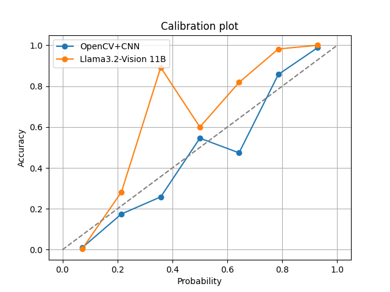
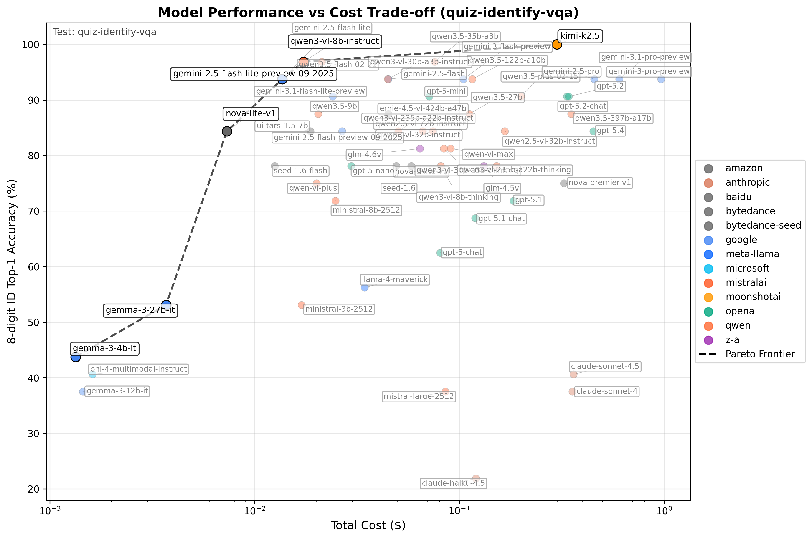

# Vision LLM - Batch Document VQA with structured responses



> [!NOTE]  
> See details in the associated [wiki](https://github.com/IonMich/batch-doc-vqa/wiki/Row-of-Digits-OCR:-OpenCV-CNN-versus-LLMs) article.

This repository uses Large Language Models with vision capabilities to extract information from collections of documents. The goal is to create a fully local pipeline that runs on a single machine, and can be used to extract information from document collections for usage in downstream tasks.

## How to use

### Installation

1. Run the following commands to clone the repository:

    ```bash
    git clone https://github.com/IonMich/batch-doc-vqa.git
    cd batch-doc-vqa
    ```

2. Install dependencies using uv (recommended) or pip:

    **With uv (recommended):**

    ```bash
    # Install uv if you haven't already
    curl -LsSf https://astral.sh/uv/install.sh | sh
    
    # Install dependencies
    uv sync
    ```

    **Or with conda/pip:**

    ```bash
    conda create -n batch python=3.11
    conda activate batch
    pip install -r requirements.txt
    ```

### Prepare the documents

It is common for a batch of documents to be stored in a single large PDF file. Since multimodal LLMs can only process images, the first step is to convert the PDF file into a collection of images. (Of course, if you already have a collection of images, you can skip this step.) This can be done using the `pdf_to_imgs.py` script. For example, to convert a batch of 4-page documents into images stored in a single PDF file `imgs/quiz11-presidents.pdf` to images at 300 DPI, you can run the following command:

```bash
python pdf_to_imgs.py --filepath imgs/quiz11-presidents.pdf --pages_i 4 --dpi 300 --output_dir imgs/q11/
```

This will create a directory `imgs/q11/` containing the images of the 4-page documents. Set the `--pages_i` argument to the number of pages in each document. The images will follow the naming convention `doc-0-page-1-*.png`, ..., `doc-0-page-4-*.png`, `doc-1-page-1-*.png`, ..., etc. A CSV file `imgs/q11/doc_info.csv` will also be created, containing the metadata of the images (the page number and the document number).

### Example Usage

The `outlines_quiz.py` script can be used to extract information from a collection of documents using local Vision LLMs. For example, to extract the 8-digit university IDs from the documents in the `imgs/q11/` directory, you can run the following command:

```bash
    python outlines_quiz.py
```

By default, this pipeline will use the `Qwen2-VL-2B-Instruct` model to extract full names, 8-digit university IDs, and section numbers from the documents. You can change the model used by setting the `--model` argument. You can change the information extracted by modifying the Pydantic schema in `outlines_quiz.py`. The extracted information will be saved in a JSON file in the `tests/output/` directory.

### Post-processing

You can analyze the extracted information using string matching algorithms. For example, take a look at the `stringmatching.ipynb` notebook to see how to match the extracted last names and university IDs to a list of entries in a CSV file.

### Testing New Models with OpenRouter

To test new vision models and add them to the benchmark tables:

1. **Run inference** on your dataset with a new model:

   ```bash
   # The script will automatically prompt for API key setup if needed
   python openrouter_inference.py --model "anthropic/claude-4-sonnet" --org "anthropic"
   ```

   The script will:
   - Check for `OPENROUTER_API_KEY` in environment or `.env` file
   - If not found, prompt you to enter it interactively
   - Without a key: only free models with limited requests are available
   - With a key: access to all models and higher rate limits
   - Offer to save the key to `.env` file for future use
   - Get your API key from: [openrouter.ai/keys](https://openrouter.ai/keys)

2. **Update benchmark tables** with the new results:

   ```bash
   # Generate comprehensive results (all models)
   python generate_benchmark_table.py --output BENCHMARKS.md
   
   # Generate README table (top performers only)
   python generate_benchmark_table.py --readme
   python update_readme_section.py
   ```

3. **Interactive model classification**: When you run the benchmark generator with a new model, you'll be prompted to classify it:
   - Is it open-weights? (y/n)
   - Number of parameters (e.g., "7B", "70A8" for MoE models)  
   - License (for open-weight models)

The system automatically saves this metadata and uses it for proper categorization in benchmark tables.

## Benchmarks

Our small test dataset (`./imgs/quiz11-presidents.pdf`) consists of 32 documents representing Physics quizzes and the task is to match them to the test students who took the quiz via their 8-digit university ID and, optionally, their names (`./tests/data/test_ids.csv`). We have already saturated our test dataset with 100% statistically confident detections, but more optimizations are explored to decrease inference cost. You can find more details [in this wiki](https://github.com/IonMich/batch-doc-vqa/wiki/Row-of-Digits-OCR:-OpenCV-CNN-versus-LLMs).

The table below shows the top performing models by category. See [BENCHMARKS.md](BENCHMARKS.md) for comprehensive results with all tested models.

<!-- BENCHMARK_TABLE_START -->

| **Metric** | **OpenCV+CNN** | **qwen**<br>qwen3-vl-8b-instruct | **qwen**<br>qwen3-vl-30b-a3b-instruct | **google**<br>gemini-2.5-pro | **google**<br>gemini-2.5-flash-lite |
|:---|:---|:---|:---|:---|:---|
| LLM model size | N/A | 8B | 30A3 | ?? | ?? |
| Open-weights | N/A | Yes | Yes | No | No |
| digit_top1 | 85.16% | **99.61%** | 99.22% | 99.22% | 99.22% |
| 8-digit id_top1 | ?? | **96.88%** | 93.75% | 93.75% | 93.75% |
| lastname_top1 | N/A | **96.88%** | 93.75% | **96.88%** | 93.75% |
| ID Avg d_Lev | N/A | **0.0312** | 0.0625 | 0.0625 | 0.0625 |
| Lastname Avg d_Lev | N/A | 0.0625 | 0.1875 | **0.0312** | 0.0625 |
| Docs detected | 90.62% (29/32) | **100.00% (32/32)** | **100.00% (32/32)** | **100.00% (32/32)** | **100.00% (32/32)** |
| Runtime | **~1 second** | 4.5 minutes | 2.3 minutes | 8.0 minutes | 2.3 minutes |
| Cost per image | **$0.00** | $0.000302 | $0.000700 | $0.007125 | $0.000214 |
| Total cost | **$0.00** | $0.0184 | $0.0448 | $0.4560 | $0.0137 |

### Performance vs Cost Trade-off

The chart below shows the Pareto frontier of models, highlighting the most cost-efficient options for different performance levels:



<!-- BENCHMARK_TABLE_END -->

## [OLD] Ollama + Llama3.2-Vision 11B

### Ollama Installation

1. First, install Ollama via the official [installation instructions](https://ollama.com/).

2. Pull the Llama3.2-Vision 11B model (or another model of your choice) on the Ollama server:

    ```bash
    ollama pull llama3.2-vision
    ```

3. Install the Python Ollama wrapper. You can do this via pip in a dedicated [conda](https://docs.anaconda.com/miniconda/) environment:

    ```bash
    conda create -n ollama python=3.11
    conda activate ollama
    pip install ollama
    ```

4. Clone this repository. There are no additional dependencies.

    ```bash
    git clone https://github.com/IonMich/batch-doc-vqa
    cd batch-doc-vqa
    ```

5. Start the Ollama server. On MacOS this can be done by simply opening the Ollama app. On Linux run `ollama server` in the terminal.

6. Check the `SYSTEM_MESSAGES` variable in `llamavision.py`. This are the prompts that the model will use to generate its responses (by default the prompt at index `0`). Leave the prompt unchanged if you want to check the installation on the test images. Feel free to add your own images to the `imgs` directory, or to change the `--filepath` command line argument to point to a different directory.

7. That's it! You're ready to use the pipeline:

    ```bash
    python llamavision.py --filepath imgs/sub-page-3.png --n_trials 10
    ```

### Usage

The Ollama pipeline is a Python scriptwith the following command line usage:

```bash
    python llamavision.py [-h] [--filepath FILEPATH] [--pattern PATTERN] [--n_trials N_TRIALS] [--system SYSTEM] [--model MODEL] [--no-stream] [--top_k TOP_K]
```

The pipeline has the following options:

- `--filepath`: (str) The path to the directory containing the images to be processed. If the path is a PNG file, the pipeline will process that single image. If the path is a directory, the pipeline will process (by default) all images in that directory.

- `--pattern`: (str) A string that is used to filter the images in the directory. E.g. `--pattern "page-3"` will only process PNG files that contain the string `page-3` in their filename. By default, this is set to `""`, which means that all images in the directory will be processed. This option is ignored if the `--filepath` is a single PNG file.

- `--n_trials`: (int) The number of trials to run for each image. This can be useful to do multi-shot inference on the same image, or to get a sense of the variance in the model's predictions.

- `--system`: (str) The system prompt index to use, which selects the prompt from a list of system prompts. By default, this is set to 0. See `SYSTEM_PROMPTS` in `llamavision.py` for the list of some example system prompts, and replace these with your own prompts.

- `--model`: (str) The model to use. By default, this is set to `llama3.2-vision`, but any LLM with vision capabilities can be used.

- `--top_k`: (int) The number of top answers to return. By default, this is set to 10. Lowering this number decreases creativity and variance in the model's predictions. Note that this is less than the Ollama default of 40.

- `--no-stream`: (flag) If set, the pipeline will not stream the LLM responses in chunks. Instead, the pipeline will wait for the model to finish processing the image before printing the responses. Default (when this flag is omitted) is to stream the responses.

## Motivations

Recent advances in LLM modelling have made it conceivable to build a quantifiably reliable pipeline to extract information in bulk from documents:

- Well formatted JSON can be fully enforced. In fact, using [context-free grammars](https://stackoverflow.com/a/6713333/10119867), precise JSON schemas can be enforced in language models that support structured responses (e.g. see [OpenAI's blog post](https://openai.com/index/introducing-structured-outputs-in-the-api/)).
- OpenAI's `GPT4 o1-preview` [appears to be well-calibrated](https://openai.com/index/introducing-simpleqa/), i.e. the frequency of its answers to fact-seeking questions is a good proxy for their accuracy. This creates the possibility to sample multiple times from the model to infer probabilities of each distinct answer. It is unclear however how well this calibration generalizes to any open-source models. It is also unclear if the purely textual SimpleQA task is a good proxy for text+vision task.
- The latest open-source models, such as the (Q4 quantized) Llama3.2-Vision 11B, show good performance on a variety of tasks, including document DocVQA, when compared to closed-source models like GPT-4. The [OCRBench Space](https://huggingface.co/spaces/echo840/ocrbench-leaderboard) on Huggingface has a nice summary of their performance on various OCR tasks.
- Hardware with acceptable memory bandwidth and large-enough memory capacity for LLM tasks is becoming more affordable.
