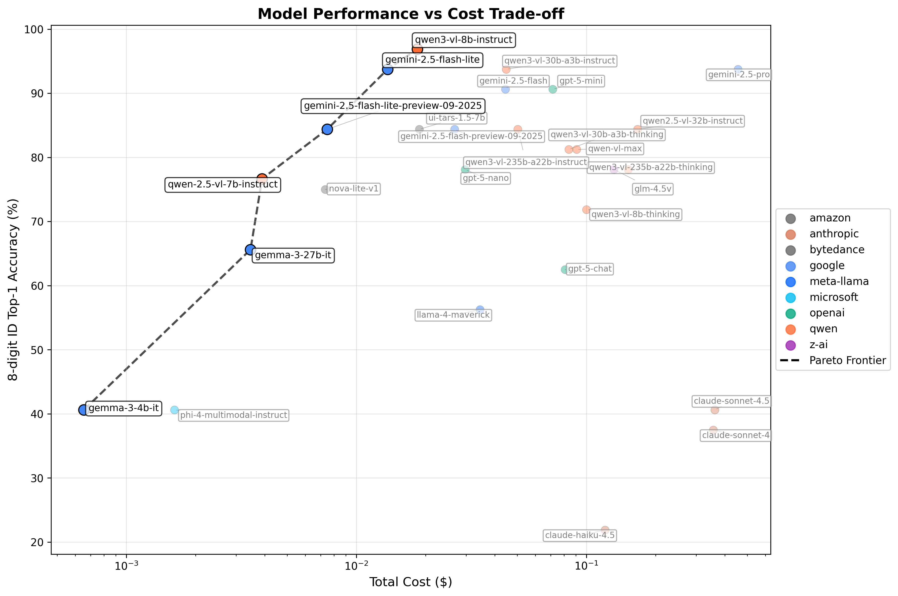

# Vision LLM - Batch Document VQA with structured responses

### Performance vs Cost Trade-off

The chart below shows the Pareto frontier of models, highlighting the most cost-efficient options for different performance levels:



## Benchmarks

Our small test dataset (`./imgs/quiz11-presidents.pdf`) consists of 32 documents representing Physics quizzes and the task is to match them to the test students who took the quiz via their 8-digit university ID and, optionally, their names (`./tests/data/test_ids.csv`). We have already saturated our test dataset with 100% statistically confident detections, but more optimizations are explored to decrease inference cost. You can find more details [in this wiki](https://github.com/IonMich/batch-doc-vqa/wiki/Row-of-Digits-OCR:-OpenCV-CNN-versus-LLMs).

The table below shows the top performing models by category. See [BENCHMARKS.md](BENCHMARKS.md) for comprehensive results with all tested models.

<!-- BENCHMARK_TABLE_START -->

| **Metric** | **OpenCV+CNN** | **moonshotai**<br>kimi-k2.5 | **qwen**<br>qwen3-vl-8b-instruct | **google**<br>gemini-3.1-pro-preview | **google**<br>gemini-2.5-flash-lite |
|:---|:---|:---|:---|:---|:---|
| LLM model size | N/A | 1000A32 | 8B | ?? | ?? |
| Open-weights | N/A | Yes | Yes | No | No |
| digit_top1 | 85.16% | **100.00%** | 99.61% | 99.22% | 99.22% |
| 8-digit id_top1 | ?? | **100.00%** | 96.88% | 93.75% | 93.75% |
| lastname_top1 | N/A | **100.00%** | **100.00%** | **100.00%** | 96.88% |
| ID Avg d_Lev | N/A | **0.0000** | 0.0312 | 0.0625 | 0.0625 |
| Lastname Avg d_Lev | N/A | **0.0000** | **0.0000** | **0.0000** | 0.0312 |
| Docs detected | 90.62% (29/32) | **100.00% (32/32)** | **100.00% (32/32)** | **100.00% (32/32)** | **100.00% (32/32)** |
| Runtime (p) | **~1 second** | N/A | 11 seconds | 1.1 minutes | 11 seconds |
| Cost per image | **$0.00** | $0.004679 | $0.000266 | $0.009424 | $0.000214 |
| Total cost | **$0.00** | $0.2995 | $0.0171 | $0.6031 | $0.0137 |


<!-- BENCHMARK_TABLE_END -->

<a href="https://deepwiki.com/IonMich/batch-doc-vqa"></a>
<!-- DeepWiki badge generated by https://deepwiki.ryoppippi.com/ -->


This repository uses Large Language Models with vision capabilities to extract information from collections of documents and reports performance within a clearly specified document‑VQA setup. The goal is to create a fully local pipeline that runs on a single machine, and can be used to extract information from document collections for usage in downstream tasks.

## Run Benchmark: Included Dataset (No Code Changes)

Run the built-in q11 benchmark end-to-end using the default `default_student` extraction task.

This repo includes benchmark inputs, but not pre-rendered benchmark images:

- Source PDF: `imgs/quiz11-presidents.pdf`
- Ground truth: `tests/data/test_ids.csv`

You will generate `doc_info.csv` and page images locally in one command.

### 1. Clone the repository

```bash
git clone https://github.com/IonMich/batch-doc-vqa.git
cd batch-doc-vqa
```

### 2. Install `uv`

```bash
curl -LsSf https://astral.sh/uv/install.sh | sh
```

After `uv` is installed, run commands directly with `uv run ...`.
No `uv sync`, `pip install`, or conda setup is required for this workflow.

### 3. Generate benchmark images + `doc_info.csv`

```bash
uv run --with pymupdf pdf-to-imgs \
  --filepath imgs/quiz11-presidents.pdf \
  --pages_i 4 \
  --dpi 300 \
  --output_dir imgs/q11
```

What this does:

- Splits the source PDF into PNG page images in `imgs/q11/`.
- Treats every `4` pages as one document (`--pages_i 4`), so filenames map to `doc-<index>-page-<n>-*.png`.
- Writes `imgs/q11/doc_info.csv` with `doc,page,filename` so downstream commands know exactly which images belong to each document.

### 4. Run OpenRouter inference (interactive organization + model selection, then provider approval)

```bash
uv run openrouter-inference \
  --concurrency 64 \
  --rate-limit 64
```

The command checks for `OPENROUTER_API_KEY` and prompts for setup if missing ([openrouter.ai/keys](https://openrouter.ai/keys)).


What this command does by default:

- Since `--model` is omitted, the terminal UI asks you to choose organization + model.
- Uses preset `default_student`.
- Uses images from `imgs/q11`.
- Auto-detects dataset manifest at `imgs/q11/doc_info.csv` when present.
- Uses pages `1,3` by default for this preset.

Optional overrides:

- Use a different preset: `--preset <preset_id>`
- Use a different image directory: `--images-dir /path/to/images` (auto-detects `/path/to/images/doc_info.csv` when present)
- Use a different manifest path: `--dataset-manifest /path/to/doc_info.csv`
- Override page selection: `--pages 1,3`

Interactive flow:

1. Run the command above.
2. If prompted, enter your OpenRouter API key (and optionally save it to `.env`).
3. In the terminal UI, choose the model organization (the model creator).
4. Choose the model from that organization.
5. Review provider policies for hosts serving that model and approve to continue.
6. Confirm and start the run.

### 5. Regenerate benchmark artifacts

```bash
uv run update-benchmarks
```

This updates `BENCHMARKS.md`, `pareto_plot.png`, and the benchmark section in `README.md`.

## Run Benchmark: Synthetic Dataset (default_student, No Code Changes)

Use this when you want to automatically generate a labeled DocVQA benchmark dataset, then run the same benchmark pipeline end-to-end.
This workflow uses **PyMuPDF** for both synthetic PDF rendering and PDF-to-image conversion; `uv run --with pymupdf ...` installs it on demand.

### 1. Generate synthetic PDFs + labels

```bash
uv run --with pymupdf generate-synthetic-pdf-task \
  --entities-file docs/examples/synthetic/default_student_entities.csv \
  --task-config docs/examples/synthetic/default_student_task_config.yaml \
  --output-dir /tmp/synthetic_benchmark \
  --seed 42 \
  --overwrite
```

This writes:

- `/tmp/synthetic_benchmark/task_docs.pdf`
- `/tmp/synthetic_benchmark/test_ids.csv`
- `/tmp/synthetic_benchmark/generation_plan.json`

### 2. Convert synthetic PDF to images + `doc_info.csv`

```bash
uv run --with pymupdf pdf-to-imgs \
  --filepath /tmp/synthetic_benchmark/task_docs.pdf \
  --pages_i 4 \
  --dpi 300 \
  --output_dir /tmp/synthetic_benchmark/images
```

### 3. Run inference on synthetic images

```bash
uv run openrouter-inference \
  --preset default_student \
  --model qwen/qwen3-vl-8b-instruct \
  --images-dir /tmp/synthetic_benchmark/images \
  --concurrency 64 \
  --rate-limit 64
```

### 4. Generate benchmark table + Pareto plot

```bash
uv run generate-benchmark-table \
  --doc-info /tmp/synthetic_benchmark/images/doc_info.csv \
  --test-ids /tmp/synthetic_benchmark/test_ids.csv \
  --format markdown \
  --output /tmp/synthetic_benchmark/BENCHMARKS.md

uv run generate-pareto-plot \
  --doc-info /tmp/synthetic_benchmark/images/doc_info.csv \
  --test-ids /tmp/synthetic_benchmark/test_ids.csv \
  --output /tmp/synthetic_benchmark/pareto_plot.png \
  --title "Model Performance vs Cost Trade-off (synthetic benchmark)"
```

Optional: also generate a second Pareto plot for ID Avg d_Lev (with an inverted y-axis so lower/better distances are at the top):

```bash
uv run generate-pareto-plot \
  --doc-info /tmp/synthetic_benchmark/images/doc_info.csv \
  --test-ids /tmp/synthetic_benchmark/test_ids.csv \
  --output /tmp/synthetic_benchmark/pareto_plot.png \
  --extra-id-lev-pareto \
  --id-lev-output /tmp/synthetic_benchmark/pareto_plot_id_lev.png
```

## Run Benchmark: Your Dataset (default_student, No Code Changes)

Use this when you have a labeled dataset compatible with the default student benchmark task and want benchmark tables/plots.

### 1. Convert your PDF batch to images

```bash
uv run --with pymupdf pdf-to-imgs \
  --filepath /path/to/new-batch.pdf \
  --pages_i 4 \
  --dpi 300 \
  --output_dir /tmp/my_benchmark/images
```

This creates `/tmp/my_benchmark/images/doc_info.csv`.
Use `--pages_i` equal to the number of pages per logical document in your batch.

### 2. Prepare `/tmp/my_benchmark/test_ids.csv`

Create this CSV in Excel/Google Sheets and export as CSV.
Required columns and format:

```csv
doc,student_id,student_full_name
0,33206068,Harry S. Truman
1,89797090,Franklin D. Roosevelt
2,98470266,Herbert Hoover
```

Notes:

- `doc` must match the document index used in `doc_info.csv` (`doc-0-*`, `doc-1-*`, ...).
- Keep one row per document.
- `student_id` should be the 8-digit ground-truth ID as text.

### 3. Run inference on the new dataset

```bash
uv run openrouter-inference \
  --preset default_student \
  --model qwen/qwen3-vl-8b-instruct \
  --images-dir /tmp/my_benchmark/images \
  --concurrency 64 \
  --rate-limit 64
```

Because `pdf-to-imgs` wrote `/tmp/my_benchmark/images/doc_info.csv`, the manifest is auto-detected.

### 4. Generate benchmark markdown + Pareto plot for that dataset

```bash
uv run generate-benchmark-table \
  --doc-info /tmp/my_benchmark/images/doc_info.csv \
  --test-ids /tmp/my_benchmark/test_ids.csv \
  --format markdown \
  --output /tmp/my_benchmark/BENCHMARKS.md

uv run generate-pareto-plot \
  --doc-info /tmp/my_benchmark/images/doc_info.csv \
  --test-ids /tmp/my_benchmark/test_ids.csv \
  --output /tmp/my_benchmark/pareto_plot.png \
  --title "Model Performance vs Cost Trade-off (my benchmark)"
```

Optional: add `--extra-id-lev-pareto --id-lev-output /tmp/my_benchmark/pareto_plot_id_lev.png` to emit the additional inverted ID Avg d_Lev Pareto plot.

## Run Extraction: Your Dataset (default_student, No Code Changes)

Use this when you want structured JSON extraction only (no benchmark scoring/plots) with the built-in student task.

Default extracted fields are:

- `student_full_name`
- `university_id`
- `section_number`

If these fields match your use case, run:

```bash
uv run openrouter-inference \
  --preset default_student \
  --model qwen/qwen3-vl-8b-instruct \
  --images-dir /path/to/images \
  --concurrency 32 \
  --rate-limit 32
```

If your manifest is not at `/path/to/images/doc_info.csv`, pass `--dataset-manifest /path/to/manifest.csv`.
If your target pages differ from the preset default, pass `--pages ...`.

Results are saved under `tests/output/runs/<run_name>/results.json`.

To tune extraction behavior for your documents while keeping the same fields, edit the default preset:

- `src/batch_doc_vqa/openrouter/presets/student.py`

If you need different output fields but do not want to edit code, use a custom prompt + schema.

## Run Extraction: Your Dataset (Custom Prompt + Schema, No Code Changes)

Use this when you want extraction-only JSON outputs with your own prompt and schema, without editing Python code.

Example files included in this repo:

- `docs/examples/prompts/basic-entity-extraction.md`
- `docs/examples/schemas/basic-entity-extraction.schema.json`

```bash
uv run openrouter-inference \
  --model qwen/qwen3-vl-8b-instruct \
  --images-dir /path/to/images \
  --prompt-file docs/examples/prompts/basic-entity-extraction.md \
  --schema-file docs/examples/schemas/basic-entity-extraction.schema.json \
  --output-json /tmp/custom_entities.json \
  --concurrency 32 \
  --rate-limit 32
```

Notes:

- If your manifest is not at `/path/to/images/doc_info.csv`, pass `--dataset-manifest /path/to/manifest.csv`.
- Page selection still applies; pass `--pages ...` for your dataset.
- When `--schema-file` is provided, strict schema mode is enabled by default. Use `--no-strict-schema` for best-effort passthrough.

## Define New Task: Preset + Benchmark Logic (Code Changes)

Use this when you want a new reusable task integrated into the codebase (not just a one-off run).

For a different extraction schema or different scoring rules, update:

1. Create a new preset module (copy and adapt `src/batch_doc_vqa/openrouter/presets/student.py`)
2. Register it in `src/batch_doc_vqa/openrouter/presets/__init__.py`
3. Run inference with `uv run openrouter-inference --preset <your_preset> ...`
4. Ground-truth matching logic: `src/batch_doc_vqa/utils/string_matching.py`
5. Benchmark table metrics/rows: `src/batch_doc_vqa/benchmarks/table_generator.py`

## Other Investigations

- Statistical calibration (legacy experiment): see `statistical-calibration.md`.
- Full analysis: [Row-of-Digits-OCR: OpenCV-CNN versus LLMs](https://github.com/IonMich/batch-doc-vqa/wiki/Row-of-Digits-OCR:-OpenCV-CNN-versus-LLMs#llm-pipeline-2-ollama--llama-32-11b-vision).
- Calibration artifact used in that analysis: `tests/output/public/calibration_curves.png`.

## Motivations

Recent advances in LLM modelling have made it conceivable to build a quantifiably reliable pipeline to extract information in bulk from documents:

- Well formatted JSON can be fully enforced. In fact, using [context-free grammars](https://stackoverflow.com/a/6713333/10119867), precise JSON schemas can be enforced in language models that support structured responses (e.g. see [OpenAI's blog post](https://openai.com/index/introducing-structured-outputs-in-the-api/)).
- OpenAI's `o1-preview` [appears to be well-calibrated](https://openai.com/index/introducing-simpleqa/), i.e. the frequency of its answers to fact-seeking questions is a good proxy for their accuracy. This creates the possibility to sample multiple times from the model to infer probabilities of each distinct answer. It is unclear however how well this calibration generalizes to any open-source models. It is also unclear if the purely textual SimpleQA task is a good proxy for text+vision task.
- The latest open-source models, such as the (Q4 quantized) Llama3.2-Vision 11B, show good performance on a variety of tasks, including document DocVQA, when compared to closed-source models like GPT-4. The [OCRBench Space](https://huggingface.co/spaces/echo840/ocrbench-leaderboard) on Huggingface has a nice summary of their performance on various OCR tasks.
- Hardware with acceptable memory bandwidth and large-enough memory capacity for LLM tasks is becoming more affordable.
